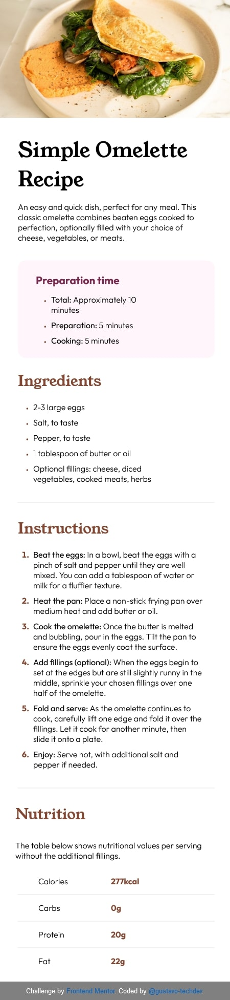
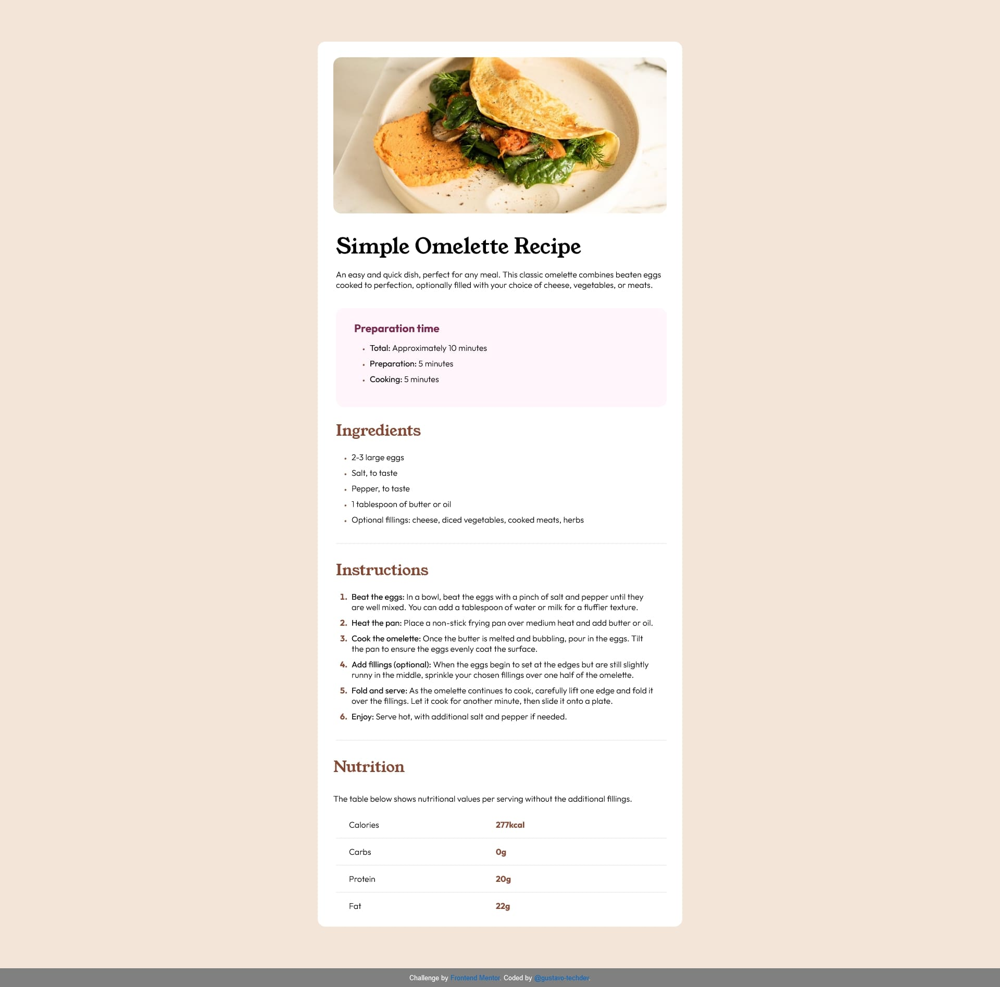

## Bem-Vindo! 👋

Obrigado por conferir esse desafio de front-end que realizei.

Desafios desse tipo disponíveis no [Frontend Mentor](https://www.frontendmentor.io) ajudam você a melhorar as suas habilidades em codar construindo projetos realistas.

**Para cumprir esse desafio, você precisa de um conhecimento básico de HTML e CSS.**

## O desafio

Seu desafio é construir essa página de receita, e chegar a um resultado de design o mais próximo possível do design original.

Você pode usar qualquer ferramenta que você preferir para cumprir esse desafio.

Você pode acessar esse desafio no link a seguir: https://www.frontendmentor.io/challenges/recipe-page-KiTsR8QQKm

# Minha versão para dispositivos móveis

# Minha versão para telas grandes

